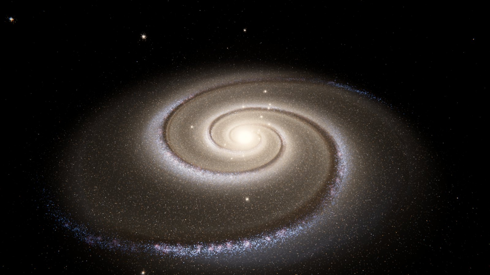
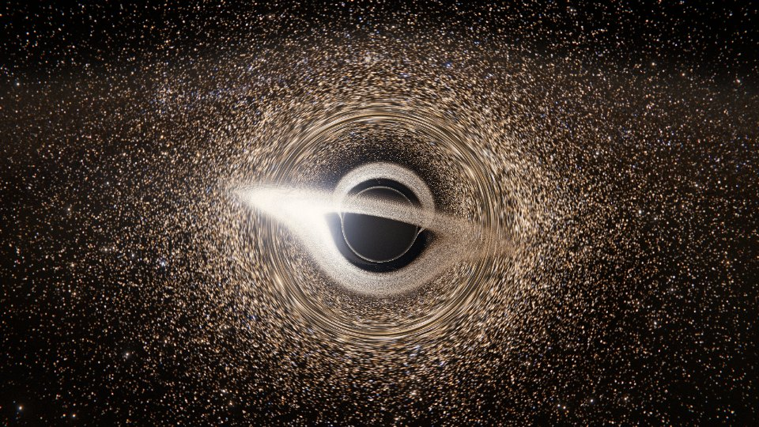
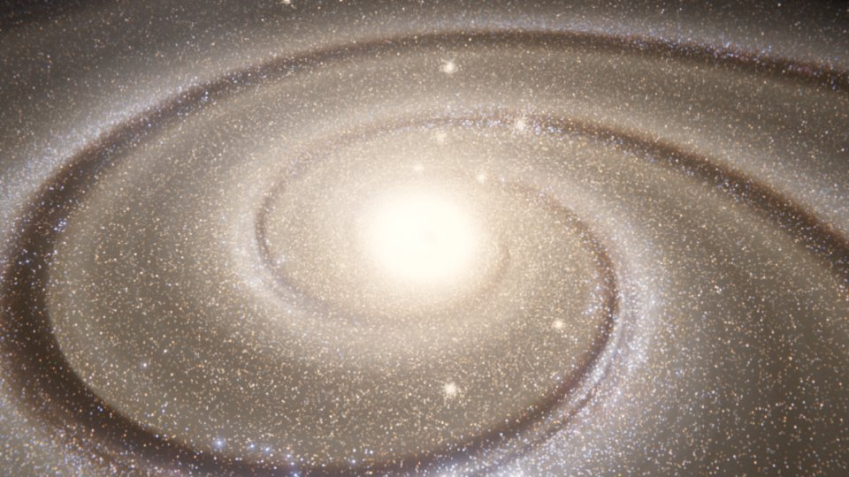
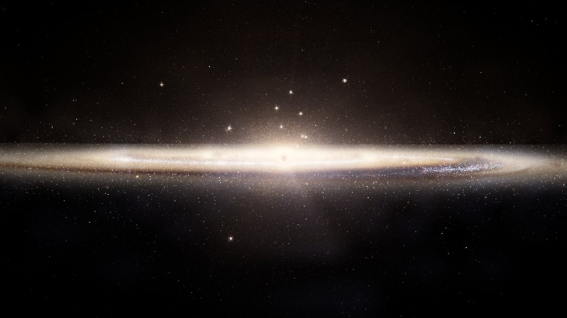

# Órbita — galáxia espiral 3D em tempo real

Visualização astronômica em WebGL2 de uma galáxia espiral vista do espaço:
**320.000 estrelas** animadas por física orbital na GPU, berçários estelares
azuis nos braços, núcleo dourado denso com um **buraco negro supermassivo**
traçado por raios, faixas de poeira que giram com o padrão espiral,
iluminação volumétrica, captura de imagens em **8K** e um **voo
cinematográfico** em loop.



| Horizonte de eventos | Ascensão | Silhueta |
| --- | --- | --- |
|  |  |  |

## Como rodar

```bash
npm install
npm run dev      # servidor de desenvolvimento (Vite)
npm test         # testes da física, do gerador e do voo (Vitest)
npm run build    # site estático em dist/ (funciona em qualquer subcaminho)
```

Requer um navegador com WebGL2. As imagens acima saíram deste código,
renderizadas em Chromium sem GPU. A principal é uma captura 8K reduzida; as
outras são quadros do voo em qualidade Média.

## Controles

| Tecla | Ação |
| --- | --- |
| `C` | Alterna entre **Cinematográfico** (voo automático) e **Livre** (órbita com o mouse) |
| `Espaço` | Pausa/retoma a simulação (a câmera continua voando) |
| `,` `.` | Velocidade do tempo: 0,1× · 0,25× · 0,5× · 1× · 2× · 4× · 10× |
| `1`–`4` | Qualidade: Baixa, Média, Alta, Ultra (sempre 320.000 estrelas) |
| `D` `B` `G` `L` | Poeira, bloom, lente gravitacional, letterbox 2,39:1 |
| `H` | Mostra/oculta a interface |
| `K` | Captura uma imagem de 7680×4320 (`Esc` cancela) |
| `F` | Tela cheia |
| `R` | Reinicia o voo |
| `?` | Lista de atalhos |

Arrastar a tela entra no modo Livre a partir do quadro atual. "Retomar voo"
volta suavemente ao ponto mais próximo do trajeto. Duplo clique no modo
Livre centraliza a órbita no ponto clicado do disco.

Parâmetros de URL úteis para compartilhar um take: `?t=66&freeze=1`
(congela o voo no segundo 66), `?paused=1`, `?quality=ultra`, `?hud=0`,
`?dust=0`, `?letterbox=1`.

## Física

- **Curva de rotação** com quatro componentes: buraco negro (kepleriano),
  bulbo de Hernquist, disco de Kuzmin e halo escuro isotérmico. A curva
  fica plana em ~1,6 su/s, e o disco externo leva de 5 a 7 minutos por volta
  na velocidade 1×.
- **Onda de densidade (Lin–Shu).** Os braços são um padrão espiral
  logarítmico (2 braços, *pitch* de 15°) que gira rigidamente. As estrelas
  antigas desaceleram ao cruzar os braços, um "engarrafamento" resolvido
  analiticamente na GPU, e por isso os braços persistem sem se enrolar.
- **Estrelas jovens e regiões HII** nascem na frente de choque, deslizam
  rio abaixo na sua própria Ω durante a vida (massas de Salpeter: estrelas
  mais massivas vivem menos) e renascem. Os aglomerados HII compartilham
  órbita e nunca se desfazem. A formação estelar ocorre em complexos ao longo
  dos braços.
- **Faixas de poeira** ficam no lado côncavo (a montante) dos braços dentro
  da corrotação e trocam de lado fora dela. Têm plumas e filamentos que
  seguem o *pitch*, e avermelham a luz de cada estrela e do volume.
- **Populações** (total exato de 320.000): aglomerado nuclear com
  "S-stars", bulbo, disco fino, disco espesso, estrelas OB, aglomerados HII,
  halo e aglomerados globulares. As cores vêm da temperatura de corpo negro.
- **Loop exato.** Todas as frequências são múltiplos de 2π/7200 s, e a GPU
  recebe o tempo módulo 7200 s calculado em precisão dupla. A simulação pode
  rodar indefinidamente sem perder precisão em float32.

## Renderização

- **Estrelas.** Um único draw call. Cada estrela é uma PSF gaussiana com asa
  de Moffat que conserva energia: estrelas abaixo de um pixel escurecem em
  vez de cintilar. Spikes de difração aparecem só nas 0,5% mais luminosas.
- **Volume.** Raymarch em meia resolução da luz difusa do disco e da
  absorção pela poeira. O núcleo dourado é uma integral de linha exata (sem
  bandas) que a poeira atravessa.
- **Buraco negro.** Raios integrados na métrica de Schwarzschild (equação
  de Binet), com deflexão analítica de campo fraco fora da esfera traçada.
  Inclui sombra, anel de fótons, disco de acreção inclinado com perfil de
  Shakura–Sunyaev, *beaming* Doppler e desvio gravitacional para o vermelho.
  O fundo é lenteado e forma anéis de Einstein.
- **Pós-processamento.** God rays a partir do núcleo, bloom, aberração
  cromática, exposição analítica (que fecha ao entrar no bulbo), ACES,
  *split-tone*, vinheta, letterbox e grão com *dither*.
- **Captura 8K.** Um pré-passe de quadro inteiro fornece o bloom e os god
  rays. Depois vêm 16 tiles com bandas de guarda, um por quadro, montados num
  PNG de 7680×4320, sem emendas.

## Estrutura

```
src/galaxy/   física (physics.js), gerador de estrelas, worker, material das estrelas
src/shaders/  órbitas, campos analíticos, estrelas, volume, buraco negro
src/render/   pipeline, passes (volume, buraco negro, god rays, grade), captura
src/camera/   voo cinematográfico (flyby.js) e diretor de câmera
src/ui/       HUD em pt-BR
tests/        física, gerador e voo
```

## Como foi feito: o conselho

O projeto foi desenhado por um "conselho" de agentes Claude. Três
especialistas propuseram especificações em paralelo:

- **astrofísico:** órbitas, populações e geometria das faixas;
- **engenheiro de renderização:** PSF, poeira, volume, buraco negro e 8K;
- **diretor de fotografia/UX:** voo, HUD e acabamento.

Um agente sintetizou as propostas e implementou o código, e um revisor
independente auditou o resultado.
